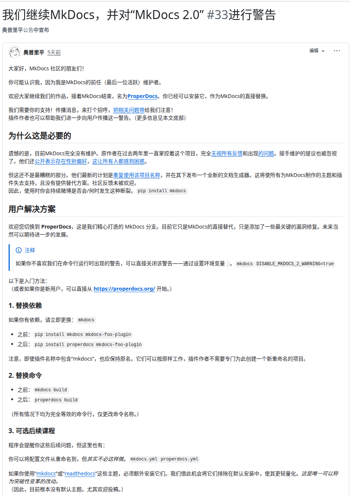

# 关于组织网站变更的说明公告（学思学习讨论研究所[2026]02号）

2026年3月21日wilber-20130410提交[今日的网站更新](https://github.com/XS-study-discuss-research-station/XS-study-discuss-research-station.github.io/commit/c6c8d451e78758001a791fd469333efd06b69255)时发现Github Actions中有如下警告：

>  │  ⚠  Warning from the Material for MkDocs team    
>  │    
>  │  MkDocs 2.0, the underlying framework of Material for MkDocs,     
>  │  will introduce backward-incompatible changes, including:     
>  │    
>  │  × All plugins will stop working – the plugin system has been removed    
>  │  × All theme overrides will break – the theming system has been rewritten     
>  │  × No migration path exists – existing projects cannot be upgraded    
>  │  × Closed contribution model – community members can't report bugs    
>  │  × Currently unlicensed – unsuitable for production use    
>  │    
>  │  Our full analysis:    
>  │    
>  │  https://squidfunk.github.io/mkdocs-material/blog/2026/02/18/mkdocs-2.0/    
> 
> ----------------------------------------------------------------
> 
> WARNING: MkDocs may break support for all existing plugins and themes soon!
> 
> The owner of MkDocs has completely abandoned maintenance of the project, and instead is planning to publish a "version 2" which will not support any existing themes, plugins or even your configuration files. This v2 may eventually replace what you download with `pip install mkdocs`, suddenly breaking the build of your existing site.
> 
> To avoid these risks, switch to ProperDocs, a continuation of MkDocs 1.x and a drop-in replacement that supports your current MkDocs setup.
> Simply install it with `pip install properdocs` and build your site with `properdocs build` instead of the MkDocs equivalents.
> 
> Alternatively, to just skip this warning in the future, you can set the environment variable `DISABLE_MKDOCS_2_WARNING=true`.
> 
> For more info visit https://github.com/ProperDocs/properdocs/discussions/33 and https://properdocs.org/
> 
> (This warning was initiated by one of the plugins that you depend on.)
> 
> ----------------------------------------------------------------

经调查发现，网站所使用的Mkdocs社区传来了噩耗，维护者放弃了Mkdocs 2.0对Mkdocs 1.x版本的兼容支持。

原代码维护者发表的博客原文翻译如下：

> # MkDocs 2.0 对你的文档项目意味着什么
> 
> 最后更新：2026年3月10日——详见[更新日志]。
> 
> ---
> 
> __三周前，MkDocs 2.0 发布——这是对成千上万项目依赖的文档工具的彻底重写，带来了潜在重大的破坏性变更。__
> 
> MkDocs的材料依赖于MkDocs作为其底层框架和核心依赖。我们维护MkDocs的材料，但对MkDocs本身没有控制权。
> 
> 我们花时间对 [MkDocs 2.0 预发布]进行了全面评估和测试，并希望分享我们的发现，包括它对您的文档项目可能意味着什么，以及我们兼容 _MkDocs 1.x_ 的新静态站点生成器 [Zensical] 在其中扮演什么角色。
> 
> __如果你错过了__：[MkDocs 1.x 未维护]，问题和 PR 不断堆积，过去 18 个月内没有发布，似乎也没有修复诸如[活载存问题]等长期存在的问题。更重要的是，目前尚不清楚安全问题是否会得到解决，以及项目未来是否会有任何更新。
> 
> _请注意，MkDocs 2.0 仍处于预发布阶段，本文信息基于项目当前状态。我们会随着最新了解持续更新。_
> 
>   [MkDocs 2.0 预发布]: https://github.com/encode/mkdocs
>   [Zensical]: zensical.md
>   [更新日志]: #updates
> 
> <!-- more -->
> 
> ## MkDocs 2.0 中有哪些变化
> 
> 根据[官方公告]、已发布的[路线图]以及项目维护者的多项先前评论和声明，MkDocs 2.0 旨在从零开始重写项目以降低复杂性——同时也带来了一些重要的权衡：:
> 
> - __MkDocs 2.0 与 Material for MkDocs 不兼容__——如果你的文档是用 Material for MkDocs 构建的，它将无法在 MkDocs 2.0 上使用。Material for MkDocs 广泛使用 MkDocs 1.x 的模板和插件系统，而 MkDocs 2.0 引入的变更不向下兼容。
> 
> - __MkDocs 2.0 不会有插件系统__——MkDocs 2.0 正在重写，重点是主题化，故意[移除插件支持以简化代码库]。我们相信[插件生态系统]是 MkDocs 成功和广泛采用的基石之一，其移除将影响团队长期以来建立的工作流程和定制。
> 
> - __MkDocs 2.0带来了主题的重大变革__——MkDocs 2.0带来了全新重写的主题系统。例如，[导航以预渲染的HTML传递给主题]，而非结构化数据。这使得技术上无法实现导航标签、可折叠部分及其他高级导航模式。
> 
>     它还限制了主题中导航的样式，因为导航的 HTML 无法调整以适应主题的结构和设计。
> 
> - __MkDocs 2.0采用封闭贡献模式__——MkDocs 2.0转向“维护者驱动的问题”模式，社区成员[被要求不要打开问题或拉取请求]，且“功能请求通常不被接受”。用户在遇到问题时应如何报告漏洞或寻求修复尚不清楚。
> 
> - __MkDocs 2.0目前未获得许可__——MkDocs 2.0没有明确规定许可，这会影响社区如何使用和贡献。这一决定背后的理由尚不清楚，但依赖MkDocs文档项目的团队和组织应当进行批判性评估。
> 
> - __MMkDocs 2.0 采用了新的配置格式__——MkDocs 2.0 使用 TOML 进行配置，这与 MkDocs 1.x 中使用的 YAML 格式不兼容。因此，现有`mkdocs.yml`文件目前无法在 MkDocs 2.0 上使用。现有项目没有迁移路径。
> 
> 尚未公布上映日期，因此围绕具体时间表进行规划仍然困难。不过，维护者多次暗示了该方向，预发布版本已确认这些变更对现有项目的影响。
> 
>   [官方公告]: https://github.com/mkdocs/mkdocs/discussions/4077
>   [路线图]: https://github.com/squidfunk/mkdocs-material/issues/8478#issuecomment-3778358483
>   [被要求不要打开问题或拉取请求]: https://github.com/encode/mkdocs?tab=contributing-ov-file#maintainer-driven-issues
>   [移除插件支持以简化代码库]: https://github.com/mkdocs/mkdocs/discussions/3815#discussioncomment-10398312
>   [插件生态系统]: https://github.com/mkdocs/catalog?tab=readme-ov-file#contents
>   [导航以预渲染的HTML传递给主题]: https://www.encode.io/mkdocs/styling/#templates
>   [MkDocs 1.x 未维护]: https://github.com/mkdocs/mkdocs/discussions/4010
>   [活载存问题]: https://github.com/squidfunk/mkdocs-material/issues/8478
> 
> ## 这对你意味着什么
> 
> 值得关注的是：MkDocs的长期方向正在以与许多文档团队及其工具目前运作方式不同的方向转变。
> 
> 虽然你现有的 MkDocs 项目今天应该能继续运行，但请注意，MkDocs 1.x 的未来更新可能性不大。MkDocs 2.0 目前的形式并非 MkDocs 1.x 的直接替代，也没有为现有项目提供明确的迁移路径。
> 
> ??? info "如何禁用 MkDocs 2.0 不兼容警告"
> 
>     从Mkdocs 9.7.2的Material开始，在构建过程中会显示关于即将到来的MkDocs 2.0变更的警告。我们添加此警告，旨在确保用户了解 MkDocs 2.0 对其项目的潜在影响，并鼓励他们评估选项并据此规划。
>
>     要禁用此警告，请设置以下环境变量：
> 
>     ``` bash
>     export NO_MKDOCS_2_WARNING=1
>     ```
> 
> ## 我们很早就提出了担忧
> 
> 鉴于维护者在[2024年8月]的公开视频通话中已向我们展示了他的计划，这一切对我们来说并不意外。由于不确定维护者是否会执行这些计划，我们只在脚注中提及，但 MkDocs 2.0 的预发布版本确认现有项目将有重大破坏性变更：
>
> 以下是事件时间线的总结：
> 
> > 在我们向 MkDocs 维护者[提出此问题]后，维护者职位于 2024 年中期[发生变化]，开始从零开始重写，旨在解决加载缓慢的问题，仅[渲染当前构建的页面]。目前尚不清楚该重写将如何与现有插件的需求集成。复杂插件如 [mkdocstrings] 或我们内置的博客和标签插件需要协调构建所有页面，以准确解析页面间链接和计算资源，而这些数据必须先构建整个项目。
> >
> > __更新__{ title="August 21, 2024" }：新维护者现在公开表示，他正在开发[一个不需要也不支持插件]的新版本 MkDocs，并提到它将通过模板、主题和样式等自定义功能实现同样的功能，他在[8月1日的团队会议]中也向我们和其他几位用户提及了这一点。在这次电话会议中，[我们多次提出反对意见]，质疑这将如何影响生态系统，但都无济于事。没有提供插件支持的意图或路线图。这一发展与我们的目标相契合，旨在通过模块化赋能用户和组织将核心框架适应自身需求。我们正在努力解决这一问题，并为我们的社区提供前进的道路。
> 
> 一旦得知这些计划，[我们立刻开始着手]开发后来成为[Zensical]的产品——一款新的静态站点生成器，设计上向下兼容MkDocs 1.x，并为现有文档项目提供可靠的长期归宿。
> 
> 多年来，我们一直在内部改进MkDocs。我们编写了12个插件，这让我们深入理解了插件API的局限性。我们对生态系统进行了定量和定性分析，以找出MkDocs的不足之处，并与数十个组织和关键生态系统成员进行了交流。我们提出这些问题，但屡屡无果。当MkDocs 2.0的新方向显现时，思考已经完成。
> 
> 我们曾考虑分叉 MkDocs，但很快意识到不可行：生态系统中的每个插件都直接依赖于 ，这意味着分叉 MkDocs 需要分支其 300 个插件中的每一个—— __就像一次性搬迁整个城市__ 一样。[^1]
> 
>   [^1]:
>     通过在运行时使用 Python 的导入钩子机制（即自定义`sys.meta_path`查找器/加载器或`importlib`封装器）对所有 MkDocs 导入进行插入，技术上可以实现分支。在这种模式下，通过解析导入请求到其他实现，或在模块初始化时代理和补丁对象，有效地跟踪 MkDocs 模块。
> 
>     然而，这种方法根本上依赖于严格的API和行为兼容性，这些API与MkDocs内部模块图的兼容性。由于导入是动态解析并在首次加载后缓存的，函数签名、类布局、副作用或导入顺序的任何差异都可能导致细微的断裂。因此，所有内部API——不仅仅是公开表面——都必须以近乎精确的保真度保存。
> 
>     实际上，这使“叉”变成了一层薄薄的间接，而非真正的发散。核心功能无法被有意义地重构或重新设计，否则会违反代码库中嵌入的隐含契约。因此，MkDocs 1.x更深层的系统性和结构性局限性在该策略下基本未变。
> 
> 由于分叉不切实际，我们不得不从头开始。
> 
>   [我们立刻开始着手]: transforming-material-for-mkdocs.md
>   [事件时间线]: transforming-material-for-mkdocs.md#fn:7
>   [2024年8月]: https://github.com/mkdocs/mkdocs/discussions/3671#discussioncomment-10164237
>   [300 个插件]: https://github.com/mkdocs/catalog?tab=readme-ov-file#contents
>   [提出此问题]: https://github.com/mkdocs/mkdocs/issues/3695
>   [发生变化]: https://github.com/mkdocs/mkdocs/discussions/3677
>   [重写]: https://github.com/mkdocs/sketch
>   [渲染当前构建的页面]: https://github.com/mkdocs/mkdocs/issues/3695#issuecomment-2117939743
>   [mkdocstrings]: https://mkdocstrings.github.io/
>   [一个不需要也不支持插件]: https://github.com/mkdocs/mkdocs/discussions/3815#discussioncomment-10398312
>   [8月1日的团队会议]: https://github.com/mkdocs/mkdocs/discussions/3671#discussioncomment-10164237
>   [我们多次提出反对意见]: https://github.com/mkdocs/mkdocs/discussions/3671#discussioncomment-10215445
>   [a reliable, backward-compatible home]: https://zensical.org/compatibility/
> 
> ## Zensical的用武之地
> 
> [Zensical][website]设计为 __MkDocs 1.x的直接替代__ ，目标是让你在不做任何更改的情况下构建现有项目。_我们还没有完全达到那个目标_——支持生态系统中最受欢迎的MkDocs插件是一项雄心勃勃的任务——但这是我们当前的重点，我们全力以赴实现目标。
> 
> 与其把这当作营销推介，我们鼓励你阅读公告，如果你想了解Zensical与MkDocs的不同，以及你现在可以期待什么。此外，我们网站的[兼容性部分]还概述了哪些功能已支持且未做更改。
> 
> 我们还鼓励您自行调研，评估对项目的影响，并考虑所有可用选项。如果您曾专业依赖 Material for MkDocs，重视我们的工作，并希望找到明确的前进路径，我们提供迁移的实际支持。
> 
> _如果你有任何问题，欢迎随时联系 hello@zensical.org 的Kathi。_
> 
> ## 更新
> 
> - __2026年3月10日__：我们发布了9.7.5版本，限制了MkDocs的版本范围。这确保了即使发布了 MkDocs 2.0，你的构建也能继续正常工作。
> 
> - __2026年3月10日__：3月9日移除的维护者包访问权限似乎已恢复[问权限似乎已恢复](https://github.com/orgs/ProperDocs/discussions/1#discussioncomment-16060966)，包括MkDocs的原始创建者。 
> 
> - __2026年3月9日__：前任维护者更改了PyPI[^2][上`mkdocs`包的所有权](https://web.archive.org/web/20260310162839/https://github.com/mkdocs/mkdocs/discussions/4089)，移除了所有其他维护者，包括MkDocs原始开发者的访问权限。
> 
> [^2]:
>   该链接指向网络档案，因为原帖已被前任维护者多次编辑。
> 
> - __2026年3月4日__：我们添加了一段，说明之前试图解决这一问题的尝试均未成功，以及我们为何决定为社区寻找新的道路。
> 
> - __2026年3月3日__：我们新增了一段关于MkDocs 2.0采用的新贡献模式，以及从我们角度看对用户和贡献者的影响。
> 
> - __2026年2月27日__：我们在环境变量`NO_MKDOCS_2_WARNING`上添加了说明，以禁用Material for MkDocs中MkDocs 2.0不兼容警告。
> 
> - __2026年2月19日__：发布的MkDocs 2.0路线图已被删除。链接现在指向一个问题评论，其中包含最后版本路线图的截图。
> 
> - __2026年2月13日__：MkDocs 1.x 和 MkDocs 2.0 项目计划兼容的相关内容已从 MkDocs 2.0 [`README.md`](https://github.com/encode/mkdocs/commit/313d3e8#diff-b335630551682c19a781afebcf4d07bf978fb1f8ac04c6bf87428ed5106870f5L52) 中移除。 
> 
>  [compatibility section]: https://zensical.org/compatibility/features/
>  [迁移的实际支持]: https://zensical.org/spark/
>  [website]: https://zensical.org
>  [why we built Zensical]: zensical.md
>  [兼容性部分]: https://zensical.org/compatibility/features/
>  [module system]: https://zensical.org/about/roadmap/#module-system

经过研究决定，网站决定从Mkdocs切换到properdocs，这是一个完美的替代品。



**学思学习讨论研究所**

**2026年3月21日**